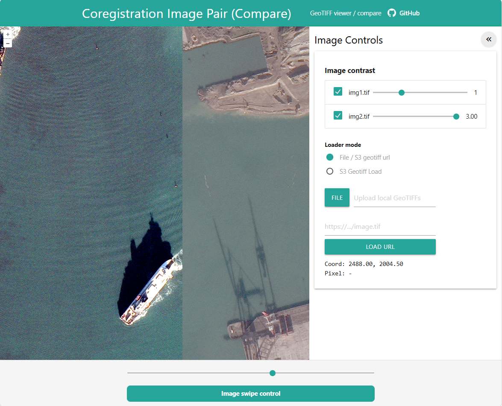

# Coregistration Pairs Viewer (DisplayGeo)

A small Nodejs with OpenLayers GeoTIFF compare/viewer with a swipe control and contrast sliders.

## Screenshot

## Features
- Local GeoTIFF upload
- Load GeoTIFF via direct URL
- Load GeoTIFFs from an S3 bucket (list & select)
- Swipe compare and per-layer contrast control

## Quick start
1. Install dependencies:

	npm install

2. Start the dev server:

	npm run start

3. Open the app in your browser (vite default):

	http://localhost:5173

## S3 GeoTIFF usage
The app can list and load GeoTIFF objects directly from an S3 bucket. For security, credentials are not entered in the UI — instead provide them as Vite environment variables during local development.

1. Copy `.env.example` to `.env` and fill in your values:

	VITE_AWS_REGION=us-east-1
	VITE_AWS_ACCESS_KEY_ID=YOUR_AWS_ACCESS_KEY_ID
	VITE_AWS_SECRET_ACCESS_KEY=YOUR_AWS_SECRET_ACCESS_KEY
	VITE_AWS_SESSION_TOKEN=

2. Start the app (`npm run start`). The `VITE_` variables are available to the client bundle in development.

3. In the app UI:
- Open the right-side panel and select `S3 Geotiff Load`.
- Enter the `S3 Bucket` name and an optional `Prefix` (folder path).
- Click `List objects` to populate the dropdown with matching objects.
- Select an object and click `Load selected` to add it as a GeoTIFF layer.

Notes:
- The app signs S3 ListObjectsV2 and GET requests using the supplied credentials via AWS Signature v4.
- `VITE_` env variables are embedded in the client bundle for development; do not store production secrets in client-side builds. For production, prefer a server-side proxy or pre-signed URLs.

## Other loaders
- Use the `File / S3 geotiff url` loader mode to upload local `.tif/.tiff` files or to load a GeoTIFF directly from a URL.

## Troubleshooting
- If listing objects fails, verify your bucket name, region, and that the credentials have `s3:ListBucket` / `s3:GetObject` permissions.

